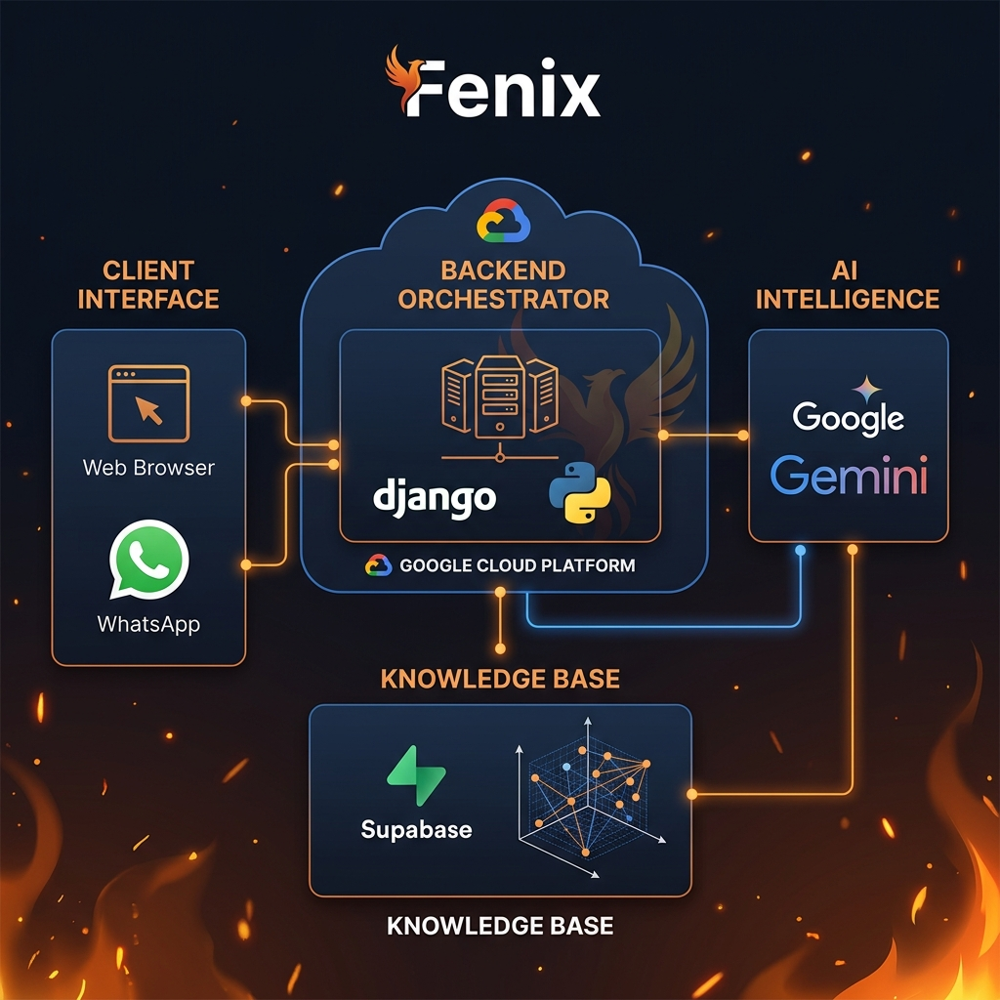

# Fenix Smart Assistant - Architecture & Implementation Plan

## 1. Overview
El **Asistente Inteligente para Fenix** es un sistema basado en IA diseñado para mejorar la experiencia del usuario y optimizar la gestión operativa de la plataforma. Actuará como un puente conversacional entre los usuarios (clientes/administradores) y los datos de Fenix (Catálogo, Pedidos, Leads).

## 2. Core Capabilities
El asistente se dividirá en dos frentes principales:

### 2.1. Customer-Facing (Public/Client)
- **Product Discovery**: Búsqueda inteligente de productos basada en descripciones semánticas, no solo palabras clave.
- **Order Status**: Consulta rápida del estado de pedidos para usuarios autenticados.
- **Soporte Preventa**: Respuestas a preguntas frecuentes sobre envíos, pagos y políticas.
- **WhatsApp Integration**: El asistente responderá de forma autónoma o asistida a través del canal de WhatsApp.

### 2.2. Admin-Facing (Internal)
- **Insights & Analytics**: Resúmenes de ventas y reportes de inventario mediante lenguaje natural.
- **Lead Qualification**: Análisis de los mensajes de contacto para priorizar leads.
- **Automatización de Notificaciones**: Sugerencias de respuestas para correos de contacto.

## 3. Technical Stack
- **LLM Engine**: Google Gemini API (preferido por integración con Synerg-IA).
- **Backend**: Django (Fenix Platform).
- **AI Orchestration**: LangChain o integración directa vía servicios de Django.
- **Database**: PostgreSQL (Supabase) + Vector Search (pgvector) para el catálogo de productos.
- **Frontend**: Widget flotante en React/Vanilla JS e integración con el webhook de WhatsApp existente.

## 4. Proposed Architecture

### 4.1. AI Service Layer (`ai_assistant/`)
Se creará una nueva app en Django llamada `ai_assistant` que contendrá:
- `services.py`: Lógica para interactuar con el LLM.
- `prompts.py`: Gestión de system prompts y templates.
- `tools.py`: Funciones que el LLM puede llamar (Function Calling) para consultar la DB de Fenix de forma segura.

### 4.2. Database Integration (RAG)
Para que el asistente "conozca" los productos:
1. **Embeddings**: Generar vectores de las descripciones de productos.
2. **Vector Store**: Usar `pgvector` en la base de datos actual de Supabase para almacenar y buscar estos vectores.
3. **Retrieval**: Recuperar los productos más relevantes antes de pasar la consulta al LLM.

### 4.3. Interface Points
1. **Web Chat Widget**: Un componente UI premium inyectado en todas las páginas de la plataforma.
2. **WhatsApp Webhook**: Extensión del servicio actual en `whatsapp/views.py` para procesar mensajes a través del motor de IA.

## 5. Security & Privacy
- **RBAC (Role Based Access Control)**: El asistente solo accederá a datos permitidos según el token del usuario.
- **Sanitization**: Limpieza de inputs para evitar Prompt Injection.
- **Privacy**: No se enviarán datos sensibles de usuarios al LLM, solo identificadores necesarios y contenido público.

## 6. Phase 1 Implementation Roadmap
1. **Setup**: Configuración de API Keys y nueva app `ai_assistant`.
2. **Product Indexing**: Script para generar embeddings del catálogo actual.
3. **Core API**: Endpoint `/api/assistant/chat/` para procesar consultas básicas.
4. **Tooling**: Implementación de `get_product_info` y `check_order_status`.
5. **UI Launch**: Integración del widget de chat en la plantilla base de Django.
